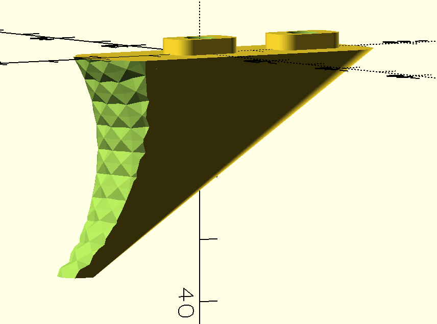

# mlok.scad



An OpenSCAD library for parametric M-LOK compatible geometry. Generates female receiver slots, clearance panels, and male accessory bases with integrated screw pass-throughs.

**Requires [BOSL2](https://github.com/BelfrySCAD/BOSL2).**

> Source: [https://github.com/shadow-w0rx/Mlok-Openscad](https://github.com/shadow-w0rx/Mlok-Openscad)

---

## Installation

1. **Download** the latest zip from GitHub:  
   [https://github.com/shadow-w0rx/Mlok-Openscad/archive/refs/heads/main.zip](https://github.com/shadow-w0rx/Mlok-Openscad/archive/refs/heads/main.zip)

2. Extract and move the folder (rename it to `mlok`) into your OpenSCAD libraries directory:

```
# macOS
~/Documents/OpenSCAD/libraries/mlok/

# Linux
~/.local/share/OpenSCAD/libraries/mlok/

# Windows
C:\Users\<YourName>\Documents\OpenSCAD\libraries\mlok\
```

3. In your design file:

```scad
include <mlok/mlok.scad>
```

> **Tip:** You can also add an arbitrary folder as an OpenSCAD library path via  
> *Edit → Preferences → Libraries*.

---

## Modules

### `mlok_female_slots`
Subtractive geometry for M-LOK receiver slots. Use inside a `difference()`.

```scad
mlok_female_slots(
  num_slots           = 1,
  h                   = 3.810,   // mounting surface thickness
  flat_w              = 15.240,  // total clearance width
  flat_ext            = 7.620,   // clearance extension past slot ends
  add_clearance_flats = false,   // also subtract top/bottom clearance pockets
  clearance_height    = 5        // depth of clearance pocket extrusion
);
```

**Example — 3-slot receiver plate:**
```scad
include <mlok/mlok.scad>

difference() {
  cuboid([140, 100, 3.81]);
  mlok_female_slots(num_slots = 3, h = 3.81, add_clearance_flats = true);
}
```

---

### `mlok_flat_panel`
Additive flat panel sized to span `num_slots` positions. BOSL2 children attach via anchors.

```scad
mlok_flat_panel(
  num_slots = 1,
  h         = 3.810,
  flat_w    = 15.240,
  flat_ext  = 7.620,
  rounding  = 0
);
```

---

### `mlok_receiver_panel`
Convenience module: a flat panel with female slots already cut — equivalent to composing `mlok_flat_panel` + `mlok_female_slots` manually, but in one call.

```scad
mlok_receiver_panel(
  num_slots           = 1,
  h                   = 3.810,
  flat_w              = 15.240,
  flat_ext            = 7.620,
  rounding            = 0,
  add_clearance_flats = false,
  clearance_height    = 5
);
```

**Example:**
```scad
include <mlok/mlok.scad>

mlok_receiver_panel(num_slots = 3, h = 3.81, add_clearance_flats = true);
```

---

### `mlok_slot_filler`
A friction-fit plug for an unused M-LOK slot. Use the same `slop` value as your receiver panel.

```scad
mlok_slot_filler(
  h    = 3.810,   // thickness — match your mounting surface
  slop = 0.15     // per-side clearance
);
```

---

### `mlok_male_lugs`
Additive male lug pairs for `num_lugs` individual lug tabs. Intended as a child of a BOSL2 `diff()` body — screw holes are tagged `"screw_hole"` and diffed by the parent.

Male accessories are specified in **individual lug tabs** (not slot positions), because a single lug (half-slot) is a valid mount and odd numbers like 3 are common. 2 lugs = 1 full slot position.

```scad
mlok_male_lugs(
  num_lugs              = 6,      // total individual lug tabs (2 per slot position; odd trims last slot)
  h                     = 2.5,    // lug protrusion height (default: MLOK_LUG_H)
  slop                  = 0.15,   // per-side clearance reduction for print fit
  screw_d               = 5.2,    // pass-through screw hole diameter
  parent_height         = 8,      // height of parent body (sizes the bore)
  screw_interval        = 2,      // place a screw hole every N lugs
  screw_interval_offset = 0,      // skip this many lugs before the first screw hole
  screw_head_d          = 0,      // counterbore diameter (0 = auto: screw_d × 1.8)
  clear_screw_top       = 0       // extend the screw bore this many mm past the parent body top
);
```

---

### `mlok_male_base`
Composed accessory blank: a body with `mlok_male_lugs` on the bottom and screw bores diffed through. Children are forwarded to the inner cuboid, so you can attach additional geometry via BOSL2 `position()`.

```scad
mlok_male_base(
  num_lugs              = 4,
  lug_h                 = 2.5,    // lug protrusion height
  slop                  = 0.15,
  screw_d               = 5.2,
  screw_interval        = 2,
  screw_interval_offset = 0,
  screw_head_d          = 0,      // counterbore diameter (0 = auto)
  base_height           = 8,
  rounding              = 1.5,
  flat_w                = 15.240,
  flat_ext              = 7.620
);
```

**Example — simple 2-slot (4-lug) accessory:**
```scad
include <mlok/mlok.scad>

mlok_male_base(num_lugs = 4, slop = 0.15, screw_d = 5.2);
```

**Example — adding geometry on top via children:**
```scad
mlok_male_base(num_lugs = 4, screw_d = 5.2) {
  position(TOP)
    cyl(h = 20, d = 14, anchor = BOTTOM);
}
```

---

## Helper Functions

### `mlok_male_dimensions(num_lugs, flat_w, flat_ext)`
Returns `[length, width]` of a male accessory body sized to exactly fit `num_lugs` lug tabs. Use this for sizing any male accessory — it accounts for partial slots correctly.

```scad
dims = mlok_male_dimensions(3);  // exactly 3 lugs, not rounded to 4
```

### `mlok_flat_dimensions(num_slots, flat_w, flat_ext)`
Returns `[length, width]` of a female receiver panel for a given slot count.

```scad
dims = mlok_flat_dimensions(3);
echo(dims);  // [128.891, 15.240]
```

---

## Examples

### `examples/demo.scad`
Open in OpenSCAD to see a female receiver block and male accessory base rendered side-by-side. All parameters are exposed in the Customizer.

### `examples/handstop.scad`
A real-world M-LOK handstop built on top of the library. Demonstrates how to use `mlok_male_lugs` inside a custom `diff()` body rather than using `mlok_male_base`.

Key techniques shown:
- **Hollow shell** — a reusable `shell()` submodule wraps `prismoid()`; the interior is scooped out by subtracting a slightly smaller, upward-offset shell, leaving a solid floor.
- **Grip texture** — a large-radius `cyl()` with `rounding=-8` and a `texture=` surface is positioned against the front face to carve a concave textured grip.
- **BOSL2 `diff()` with multiple tags** — `diff("shell_cutout screw_hole")` handles both the interior hollow and the M-LOK screw bores in one pass.

```scad
include <mlok/mlok.scad>

handstop(num_lugs = 2, screw_interval = 1);
```

### `examples/sling_stud.scad`
A QD-style sling stud mount built on top of the library. A rectangular M-LOK base with a cylindrical post and lateral sling-attachment bore. Demonstrates `mlok_male_lugs` inside a multi-tag `diff()` with a nested child geometry.

```scad
include <mlok/mlok.scad>

sling_stud(num_lugs = 2, screw_interval = 1);
```

---

## License

This project is provided as-is for personal and commercial use. M-LOK® is a registered trademark of Magpul Industries Corp. This library is not affiliated with or endorsed by Magpul.

